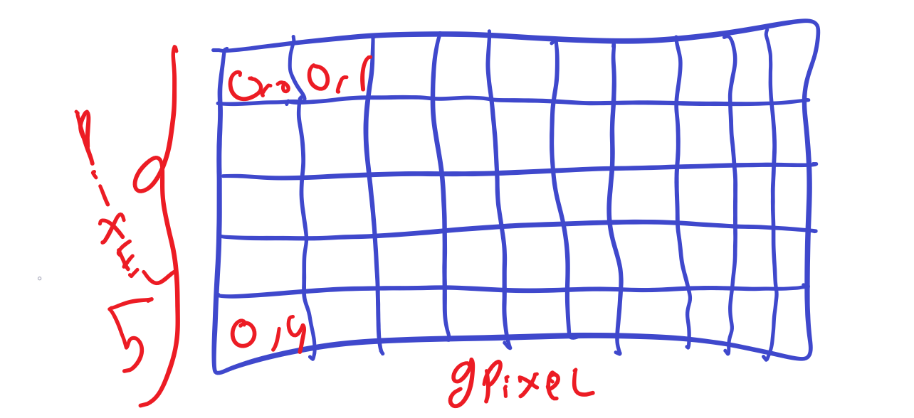
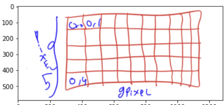
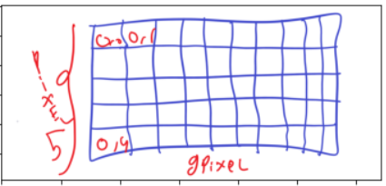

## Image Processing
Image processing Levels : 
- Low-level Process , The output is Image : 
	- Noise Removal
	- Image Sharpening
	- Illumination Normalization
	- Perspective correction
- Mid-level Process, The output is number representation :
	- Rectangle point (x,y)
- High-level Process , The output is the **Final Process** :
	- Cat, Dog, Car, Object detection
	-  Face recognition
	-  Emotion Recognition

image-Formulation
Image can be described as **2D** function i.e ***(x, y)*** as the coordinates and the pixel can be described as ***f(x,y)*** :
- *x* $\epsilon$ [0, h-1]  where h is the height of the image
- *y* $\epsilon$ [0, w-1] where w is the width of the image
- *f(x, y)* $\epsilon$ [0, L-1] where L = 256 (8 bit image) 

## The Coordinate system of an image
image system on python represented as numpy array.

Note
Reading image

	img = cv2.imread("imagePath")

Getting shape (Row, Column, Channels < R , G , B>)

	print(f"shape {img.shape}")

Datatype of an image is important, **uint8** means that values ranged from [0 - 255]

	print(img.dtype)

Image RGB data can be get like so :  Open cv Use **BGR** Order 

	x= 40
	y= 6
	(b, g, r) = img[6: 40]
	
Image Gray Scale can be get like so : 

	gray_img = cv2.imread("imgRepresentation.png",cv2.IMREAD_GRAYSCALE)

No Channel provided, can be get using shape :

	print(gray_img.shape)

### BGR Representation is Different with RGB

We can Split The Image using this method :

	b , g , r = cv2.split(img)

But splitting image is time consuming, thus use Numpy indexing like so 

	img = img[:, : ,::-1]

then we merge it :

	img = cv2.merge([r,g,b])

Heres The sample : 
## With BGR Representation

## With RGB Representation

Here's Some Summary For this Basic Chapter :

- What are the Main Image Processing step ? 
- What are three image processing levels ? 

		Low Level
		Medium Level
		High Level

- what is the difference between grayscale with black and with image ?
		
		Grayscale : Ranged from (0 - 255)
		Black and white : Only 1 Values

- What is Pixel ? 

		Pixel : small Representation of an image

- Load

		img = cv2.imread("image")

- Show

		cv2.show(img)

- split

		(b,g,r) = cv2.split(img)
- merge

		merge_img = cv2.merge([r,g,b])